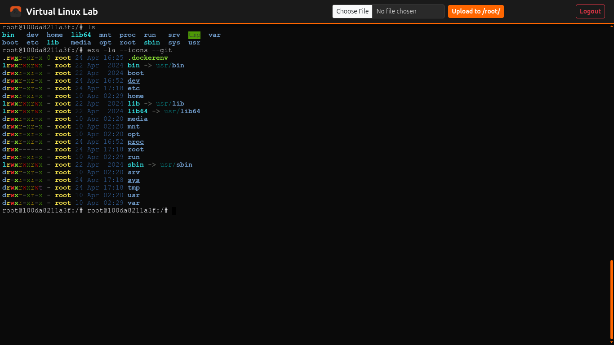
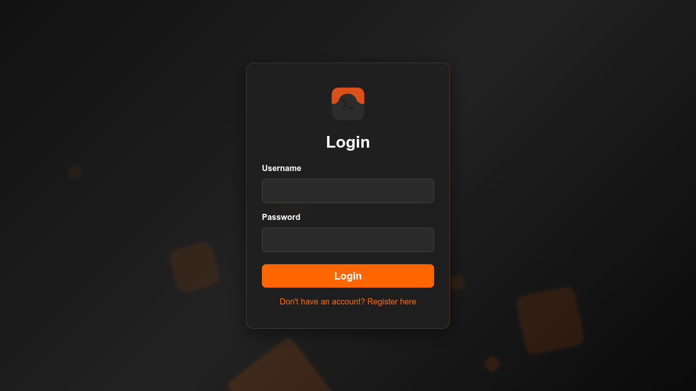
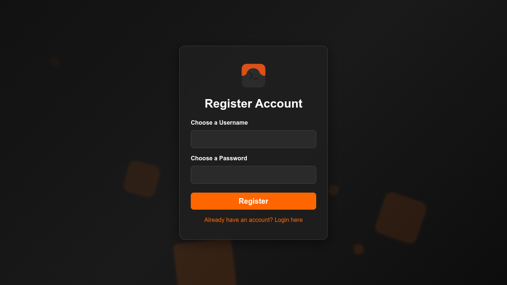

# On-demand-container-lab
A multi-tenant, on-demand Docker sandbox platform. Provision isolated, browser-based Ubuntu terminals and universal containers with real-time Socket.IO communication, file uploads, and automated inactivity cleanup.


# 🐧 Virtual Linux Lab

A lightweight, multi-tenant web application that provisions on-demand, isolated Ubuntu terminal environments directly in the browser. 

Built with Flask, Docker, WebSockets, and PostgreSQL, this platform acts as a self-hosted cloud shell (similar to Replit or GitHub Codespaces), perfect for educational labs, testing sandboxes, or remote access.

# 🐧 Universal Cloud Shell

An on-demand, multi-tenant terminal workspace that provisions isolated Docker containers directly in the browser.



## 📸 Project Gallery

| Student Login | User Registration |
| :---: | :---: |
|  |  |

## ✨ Features
* **Browser-Based Terminal:** Fully functional `xterm.js` terminal with custom theming.
* **On-Demand Provisioning:** Automatically spins up an isolated Docker container (`ubuntu:latest`) for each authenticated user.
* **Resource Limits:** Hardcoded memory limits (512MB per user) to prevent host server crashes.
* **Drag-and-Drop Uploads:** Easily upload files from your local machine directly to the container's `/root/` directory via the UI.
* **Automated Janitor:** A background daemon that monitors PostgreSQL and deletes containers belonging to users who have been inactive for 7 days.
* **Concurrent Database:** Powered by PostgreSQL to handle multiple users securely.

## 🛠️ Tech Stack
* **Backend:** Python, Flask, Flask-SocketIO, SQLAlchemy, Docker SDK
* **Frontend:** HTML5, Bootstrap 5, xterm.js
* **Database:** PostgreSQL
* **Infrastructure:** Docker

## 🚀 Installation & Setup

### Prerequisites
* Python 3.8+
* Docker installed and running
* PostgreSQL

### 1. Clone the repository
```bash
git clone [https://github.com/YOUR_USERNAME/virtual-linux-lab.git](https://github.com/YOUR_USERNAME/virtual-linux-lab.git)
cd virtual-linux-lab
```

### 2. Install dependencies
```pip install -r requirements.txt ```

### 3. Start the PostgreSQL Container
```
docker run -d \
  --name linux-lab-postgres \
  -e POSTGRES_USER=lab_user \
  -e POSTGRES_PASSWORD=supersecret \
  -e POSTGRES_DB=linux_lab_db \
  -p 5432:5432 \
  postgres:15
  ```

### 4. Initialize the Database
Run the registration app first to build the database schema.
```python register.py```
(Navigate to http://localhost:5006/register to create your first account).

### 5. Start the Main Application
```python app.py```

## 📂 Folder Structure

```
virtual-linux-lab/
├── app.py                  
├── register.py             
├── .gitignore
├── README.md
├── requirements.txt
├── templates/              
│   ├── login.html          
│   ├── register.html       
│   └── terminal.html       
└── static/
    ├── icon.png            
    └── css/
        └── bootstrap.min.css
```
## 📜 License
Distributed under the MIT License. See ```LICENSE``` for more information.

### 4. Quick Git Commands
Once you have saved those files, open your terminal in the project folder and run these commands to push it to your new GitHub repository:

```bash
git init
git add .
git commit -m "Initial commit: Virtual Linux Lab setup"
git branch -M main
git remote add origin https://github.com/zeeshan933/on-demand-container-lab.git
git push -u origin main
```